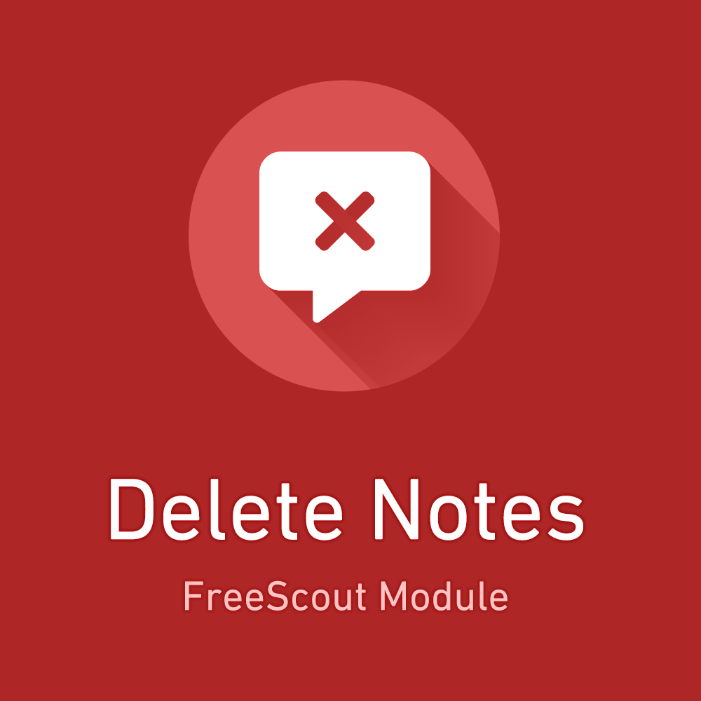

<!-- PROJECT LOGO -->
 

  

<h1 align="center">FreeScout Module: Delete Notes</h1>

  

    The Module allows FreeScout users ("support agents") to delete their own notes on conversations.
     
     
    <a href="https://freescout.shop/downloads/freescout-module-delete-notes/">View on FreeScout.shop</a>
    ·
    <a href="https://github.com/FreeScout-shop/delete-notes/issues">Report Bug</a>
    ·
    <a href="https://github.com/FreeScout-shop/delete-notes/issues">Request Feature</a>
  

  <h6 align="center">
    
Required FreeScout version: <strong>1.8.15</strong>

    
<strong>Translations included:</strong>
    🇪🇬 Arabic 🇨🇳 Chinese (simp.) 🇨🇳 Chinese (trad.) 🇭🇷 Croatian 🇨🇿 Czech 🇳🇱 Dutch 🇬🇧 English 🇫🇷 French 🇩🇪 German 🇮🇳 Hindi 🇮🇹 Italian 🇯🇵 Japanese 🇵🇱 Polish 🇷🇺 Russian 🇸🇰 Slovak 🇪🇸 Spanish 🇸🇪 Swedish

  </h6>
  

    

    <strong>🎁 This FreeScout Module is free of charge for private and commecial use.</strong> 
    <small><em>We appreciate if you consider buying one of our <a href="https://freescout.shop/paid-freescout-modules/" target="_blank">other modules</a> though! 🙃</em></small>
    

  

<!-- TABLE OF CONTENTS -->

  
Table of Contents

  <ol>
    <li>
      <a href="#about-the-project">About The Project</a>
      <ul>
        <li><a href="#built-with">Built with</a></li>
      </ul>
    </li>
    <li>
      <a href="#getting-started">Getting Started</a>
      <ul>
        <li><a href="#prerequisites">Prerequisites</a></li>
        <li><a href="#installation">Installation</a></li>
      </ul>
    </li>
    <li><a href="#contact">Contact</a></li>
  </ol>

<!-- ABOUT THE PROJECT -->
## About The Project

The Delete Notes Module allows FreeScout users to delete their own notes, a feature that has been mentioned before, but was never implemented into FreeScout.

In order to delete notes, the user is required to have acces to the (new) "Users are allowed to delete their own notes" permission:

 <small><em>Not all users have to be able to delete notes.</em></small>

When the permission is granted, a new entry in the thread dropdown menu will appear:

 <small><em>How to delete a FreeScout note?</em></small>

And after a simple prompt - who would've guessed - the note is gone for good.

(<a href="#top">back to top</a>)

### Built With

* [PHP](https://php.net/)
* [Laravel](https://laravel.com/)
* [FreeScout](https://freescout.net/)

(<a href="#top">back to top</a>)

<!-- GETTING STARTED -->
## Getting Started

This is an example of how you may give instructions on setting up your project locally.
To get a local copy up and running follow these simple example steps.

### Prerequisites

- Make sure you have write access to the `Modules` directory of your FreeScout installation.
- The required FreeScout Version is <strong>1.8.15</strong>. Go to "Manage" > "System" to see your current version.

### Installation

1. Download the module file (for free) from [https://freescout.shop](https://freescout.shop/downloads/freescout-module-delete-notes/)
2. Open the FreeScout `Modules` folder, usually located at `/var/www/html/Modules`
3. Unzip the downloaded module file into the `/Modules` folder
4. Remove the ZIP file
5. In FreeScout, go to "Manage" > "Modules"
6. Click on "Activate" to enable the module

(<a href="#top">back to top</a>)

<!-- CONTACT -->
## Contact

[FreeScout.shop](https://freescout.shop) - service@freescout.shop

Download Link: [https://freescout.shop/downloads/freescout-module-delete-notes/](https://freescout.shop/downloads/freescout-module-delete-notes/)

Repository Link: [https://github.com/FreeScout-shop/delete-notes](https://github.com/FreeScout-shop/delete-notes)

(<a href="#top">back to top</a>)
